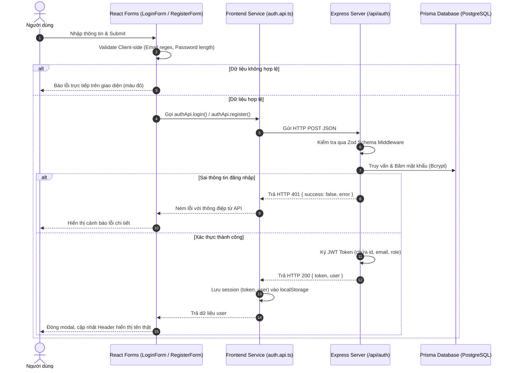

# HỆ THỐNG XÁC THỰC (AUTHENTICATION & AUTHORIZATION) - TỔNG QUAN

Tài liệu này là chỉ mục trung tâm mô tả kiến trúc hệ thống xác thực của dự án **DevFolio**. Để hỗ trợ bảo trì, sửa lỗi và nâng cấp chuyên sâu một cách độc lập, hệ thống và tài liệu được phân tách rõ ràng thành hai phần riêng biệt:

---

## 🧭 CẨM NANG HƯỚNG DẪN RIÊNG BIỆT

Tùy theo vai trò và nhiệm vụ kỹ thuật, vui lòng tham khảo tài liệu chuyên sâu tương ứng:

| Phân hệ | Tài liệu chi tiết | Đối tượng & Phạm vi kỹ thuật |
| :--- | :--- | :--- |
| 💻 **Frontend** | [**AUTH_FRONTEND_GUIDE.md**](./AUTH_FRONTEND_GUIDE.md) | Dành cho lập trình viên Client. Chi tiết về React UI Forms (`LoginForm`, `RegisterForm`), Form Validation, Tầng dịch vụ API (`auth.api.ts`), Quản lý Session (`localStorage`), Điều khiển Header & Avatar. |
| ⚙️ **Backend** | [**AUTH_BACKEND_GUIDE.md**](./AUTH_BACKEND_GUIDE.md) | Dành cho lập trình viên Server. Chi tiết về Express Router, Middleware kiểm tra định dạng dữ liệu (Zod), Middleware kiểm tra JWT Bearer, Controller, Service nghiệp vụ (Bcrypt, Prisma ORM) và Centralized Error Handler. |

---

## 1. NGUYÊN TẮC PHÂN CHIA BACKEND & FRONTEND ĐỘC LẬP

Để đảm bảo hệ thống dễ bảo trì, dễ nâng cấp và không bị phụ thuộc chéo:

1. **Giao tiếp hoàn toàn qua RESTful API tiêu chuẩn**:
   - Frontend không truy cập trực tiếp Database hay sử dụng các logic nghiệp vụ mật khẩu.
   - Toàn bộ giao tiếp sử dụng JSON format chuẩn:
     - **Request**: Chứa Body JSON sạch (đã qua client validation).
     - **Response thành công**: `{ success: true, message: string, data: object }`.
     - **Response lỗi**: `{ success: false, error: { code: string, message: string, details?: any } }`.

2. **Tầng API Service riêng biệt ở Frontend (`auth.api.ts`)**:
   - Tầng UI React không gọi trực tiếp `axios.post('/api/auth/login')`.
   - UI chỉ gọi hàm `authApi.login(credentials)`. Nếu Backend thay đổi endpoint hoặc phương thức xác thực (ví dụ đổi từ Bearer Token sang Cookie HttpOnly), bạn **chỉ cần sửa đúng 1 file `auth.api.ts`** mà không cần đụng vào giao diện hay các form JSX.

3. **Validation 2 lớp (Double-layer Validation)**:
   - **Frontend Validation**: Kiểm tra tính hợp lệ tức thì (regex email, độ dài mật khẩu) giúp người dùng nhận phản hồi ngay lập tức, tiết kiệm băng thông và giảm tải cho máy chủ.
   - **Backend Validation**: Dùng thư viện Zod parse dữ liệu nghiêm ngặt trước khi chạy controller, ngăn chặn hoàn toàn các request độc hại hoặc request không chuẩn từ Postman / cURL.

---

## 2. SƠ ĐỒ LUỒNG DỮ LIỆU TỔNG QUAN (SEQUENCE DIAGRAM)

---

## 3. BẢNG TỔNG HỢP CÁC FILE TRONG DỰ ÁN

| Phân vùng | Đường dẫn file | Vai trò chính |
| :--- | :--- | :--- |
| **Frontend** | [`apps/client/src/types/auth.ts`](file:///d:/Project/Profile/apps/client/src/types/auth.ts) | Định nghĩa cấu trúc kiểu `AuthUser` |
| **Frontend** | [`apps/client/src/shared/api/auth.api.ts`](file:///d:/Project/Profile/apps/client/src/shared/api/auth.api.ts) | Tầng trung gian gọi HTTP và quản lý LocalStorage |
| **Frontend** | [`apps/client/src/components/auth/LoginForm.tsx`](file:///d:/Project/Profile/apps/client/src/components/auth/LoginForm.tsx) | Giao diện form và xử lý đăng nhập |
| **Frontend** | [`apps/client/src/components/auth/RegisterForm.tsx`](file:///d:/Project/Profile/apps/client/src/components/auth/RegisterForm.tsx) | Giao diện form và xử lý đăng ký |
| **Frontend** | [`apps/client/src/components/auth/AuthModal.tsx`](file:///d:/Project/Profile/apps/client/src/components/auth/AuthModal.tsx) | Modal hiển thị chuyển đổi giữa Đăng nhập và Đăng ký |
| **Frontend** | [`apps/client/src/components/layout/Header.tsx`](file:///d:/Project/Profile/apps/client/src/components/layout/Header.tsx) | Thanh điều hướng, hiển thị thông tin user và Đăng xuất |
| **Frontend** | [`apps/client/src/app/App.tsx`](file:///d:/Project/Profile/apps/client/src/app/App.tsx) | Điểm gắn kết trạng thái xác thực cấp ứng dụng |
| **Backend** | [`apps/server/src/modules/auth/auth.routes.ts`](file:///d:/Project/Profile/apps/server/src/modules/auth/auth.routes.ts) | Khai báo các Route API xác thực |
| **Backend** | [`apps/server/src/modules/auth/auth.schema.ts`](file:///d:/Project/Profile/apps/server/src/modules/auth/auth.schema.ts) | Bộ quy tắc kiểm tra Zod Schema |
| **Backend** | [`apps/server/src/middlewares/validate.middleware.ts`](file:///d:/Project/Profile/apps/server/src/middlewares/validate.middleware.ts) | Middleware tự động validate dữ liệu Request Body |
| **Backend** | [`apps/server/src/middlewares/auth.middleware.ts`](file:///d:/Project/Profile/apps/server/src/middlewares/auth.middleware.ts) | Middleware xác minh JWT Bearer Token |
| **Backend** | [`apps/server/src/modules/auth/auth.controller.ts`](file:///d:/Project/Profile/apps/server/src/modules/auth/auth.controller.ts) | Tầng nhận Request và trả Response |
| **Backend** | [`apps/server/src/modules/auth/auth.service.ts`](file:///d:/Project/Profile/apps/server/src/modules/auth/auth.service.ts) | Tầng nghiệp vụ xử lý DB, mã hóa Bcrypt và JWT |
| **Backend** | [`apps/server/src/middlewares/errorHandler.ts`](file:///d:/Project/Profile/apps/server/src/middlewares/errorHandler.ts) | Xử lý lỗi toàn cục và trả format chuẩn |
